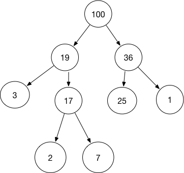

<!-- @import "[TOC]" {cmd="toc" depthFrom=1 depthTo=6 orderedList=false} -->

<!-- code_chunk_output -->

* [概述](#概述)
	* [时间复杂度](#时间复杂度)
	* [数据结构](#数据结构)
		* [Linked List](#linked-list)
		* [链表的应用](#链表的应用)
		* [Stack](#stack)
		* [Queue](#queue)
		* [Tree](#tree)
			* [Binary Tree](#binary-tree)
			* [存储二叉树](#存储二叉树)
				* [顺序存储（数组存储）](#顺序存储数组存储)
			* [二叉链表存储](#二叉链表存储)
			* [Binary Search Tree](#binary-search-tree)
			* [搜索](#搜索)
				* [广度优先搜索](#广度优先搜索)
	* [Trie](#trie)
	* [Fenwick Tree](#fenwick-tree)
	* [Heap](#heap)
	* [Hashing](#hashing)
	* [递归](#递归)

<!-- /code_chunk_output -->

# 概述

算法，在数学和计算机科学之中，为任何良定义的具体步骤的一个序列，常用于计算、数据梳理和自动推理。算法是一个有限长列表的有效方法。算法应包含清晰定义的指令用于计算函数。
算法中的指令描述的是一个计算，当其运行时能从一个初始状态和初始输入开始，经过一系列有效而清晰定义的状态最终产生输出并停止于一个终态。

算法的特征：

* 输入：一个算法必须有零个或以上输入量 
* 输出：一个算法应有一个或者以上输入量，输出量是算法计算的结果
* 明确性：算法的描述必须无歧义，以保证算法的实际执行结果是精确匹配要求或者期望，通常要求实际结果是确定的
* 有限性：依据图灵的定义，一个算法是能够被任何图灵完全系统模拟的一串运算，而图灵机只有有限个状态、有限个输入符号和有限个转移函数（指令）。而一些定义更规定算法必须在有限个步骤内完成任务
* 有效性：又称可行性。能够实现，算法中描述的操作都是可以通过已经实现的基本运算执行有限次来实现。

常用的设计模式：

* 完全遍历和不完全遍历法：最简单的算法就是把解空间的所有元素完全遍历一遍，逐个检测元素是否为我们要的解。这是最直接的算法，实现往往最简单。当解空间特别庞大时，这种算法很可能导致工程上无法承受的计算量。这时候可以利用不完全遍历方法--例如各种搜索法和规划法---来减少计算量
* 分治法：把一个问题分割成互相独立的多个部分分别求解的思路，这种求解思路带来的好处之一便于进行并行计算
* 动态规划法：当问题的整体最优解就是局部最优解组成的时候，经常采用的一种方法
* 贪心算法：场景的近似求解思路。当问题的整体最优解不是由局部最优解组成，且对解的最优性没有要求的时候，可以采用的一种方法


- **[二叉树](binarytree.md)**
- **[排序算法](sort.md)**
- **[LeetCode](leetcode.md)**

## 渐近分析

在数学分析中一种在极限附近的行为的方法。
最简单的例子如下：考虑一个函数f(n)，需要了解当n变得非常大的时候f(n)的性质。
令，在n特别大的时候，第二项3n比起第一项要小的很多。
于是对于这个函数，有如下断言："在无穷的情况下与渐近等价"，记作：。

## 时间复杂度

在计算机科学中，算法的时间复杂度是一个函数，它定量描述了该算法的运行时间。这是一个代表算法输入值的字符串长度的函数。
时间复杂度常用大O符号表示，不包括这个函数的低阶项和首项系数。使用这种方式时，时间复杂度可称为渐近的，亦即考察输入大小趋近无穷时的情况。
为了计算时间复杂度，通常会估计算法的操作单元数量，每个单元运行的时间都是相同的，因此，总运行时间和算法的操作单元数量最多相差一个常量系数
相同大小的不同输入值仍可能造成算法的运行时间不同，因此通常使用算法的最坏时间复杂度，记为<b><i>T</i>(<i>n</i>)</b>，定义为任何大小的输入n所需的最大运行时间。另一种较少使用的方法是平均情况复杂度，通常有特别指定才会使用。时间复杂度可以用函数<i>T</i>(<i>n</i>)的自然特性加以分类。

> 首项系数：%20=%20a_nx^n%20+%20a_{n-1}x^{n-1}%20+...+a_1x%20+%20a_0)的 称为f(x)的首项系数
> 低阶项：除了最高项。

使用这种方式时，时间复杂度可被称为是渐近的，亦即考察输入值大小趋近无穷时的情况。
为了计算时间复杂度，通常会估计算法的操作单元数量，每个单元运行的时间都是相同的。因此，总运行时间和算法的操作单元数量最多相差一个常量系数。
相同大小的不同输入值仍可能造成算法的运行时间不同，通常使用算法的最坏情况复杂度，T(n)，定义为任何大小的输入n所需的最大运行时间。另一种较少使用方法是平均算法复杂度

## 空间复杂度

算法的空间复杂度是指算法需要消耗的空间资源。其计算和表示方法与时间复杂度类似，一般用复杂度的渐进性来表示。同时间复杂度相比，空间复杂度的分析要简单得多

## 数据结构

是计算机中存储、组织数据的方式
数据结构意味着接口或封装：一个数据结构可被视为两个函数之间的接口，或者是由数据类型联合组成的存储内容的访问方法封装

### Linked List

链表是一种常见的基础数据结构，是一种线性表，但是并不会按线性的顺序存储数据，而是在每一个节点里存到下一个节点指针

使用链表结构可以克服数组链表需要预先知道数据大小的缺点，链表结构可以充分利用计算机内存，实现灵活的内存动态管理

链表即是由节点(Node)组成的线性集合，每个节点可以利用指针指向其他节点。它是一种包含了多个节点的，能够用于表示序列的数据结构。

### 链表的应用

链表用来构建许多其他数据结构，如堆栈，队列和他们的派生
节点的数据域也可以成为另一个链表，通过这种手段，可以用列表来构建许多链性数据结构

- 单向链表：
    链表中最简单的一种是单向链表，它包含两个域，一个信息域和一个指针域。这个链接指向列表的下一个节点，而最后一个节点则指向一个空值

    一个单链表的节点被分为两个部分。第一个部分保存或者显示关于节点的信息，第二部分存储下一个节点的地址。

    ```java
    class Node {
        int data;
        Node next;

        Node(int d) {
            data = d;
            next = null;
        }
    }
    ```
- 双向链表：
    每个节点有两个连接：一个指向前一个节点(当此“连接”时，指向空值或者空列表)；而另一个指向下一个节点(当此“连接”时，指向空值或者空列表)

    ```java
    class Node {
        private Node previous;//前驱节点
        private Node next; //后继节点
        private E e; //泛型元素
        public Node(Node previous, Node next, E e) {
            this.previous = previous;
            this.next = next;
            this.e = e;
        }
    }
    ```

- 循环链表：
    首节点和末节点被连接在一起

    ```java
    public class LinkedList {
        private Node head;
        private Node tail;
        int size;

        public LinkedList() {
            tail = head = null;
            size = 0;
        }

        public void addHead(Node hd) {
            if (size == 0) {
                hd.next = hd;
                tail = head = hd;
                size++;
            } else {
                tail.next = hd;
                hd.next = head;
                size++;
            }
        }

        public void addTail(Node tl) {
            if (size == 0) {
                tl.next = tl;
                tail = head = tl;
                size ++
            } else {
                tail.next = tl;
                tl.next = head;
                tail = tl;
                size++;
            }
        }
    }
    ```
- 时间复杂度：
  - 索引:O(n)
  - 搜索:O(n)
  - 插入:O(1)
  - 移除:O(1)

### Stack

- 栈是元素的集合，其包含了两个基本操作：push操作可以用于将元素压入栈，pop操作可以将栈顶元素移除。
- 遵循后入先出(LIFO)原则
- 时间复杂度：
  - 索引:(O(n))
  - 搜索:(O(n))
  - 插入:(O(1))
  - 移除:(O(1))

### Queue

队列是一种特殊的线性表，它只允许在表的前端(front)进行删除操作，而在表的后端(rear)进行插入操作。
进行插入操作的端称为对尾，进行删除操作的端称为对头。对列没有元素时，称为空队列

- 队列是元素的集合，其包含了两个基本操作；enqueue操作可以用于将元素插入到队列中，而dequeeu操作则是将元素从队列中移除。
- 遵循先入先出原则(FIFO)。
- 时间复杂度：
  - 索引:(O(n))
  - 搜索:(O(n))
  - 插入:(O(1))
  - 移除:(O(1))

1. ConcurrentLinkedQueue
    是一个基于连接节点的无界线程安全队列
    `add()`和`offer()`都是加入元素的方法(在ConcurrentLinkedQueue中，这两个方法没有任何区别)
    `poll()`和`peek()`都是取头元素节点，区别在于前者会删除元素，后者不会

2. BlockingQueue
    - ArrayBlockingQueue
    基于数组的阻塞队列实现，在ArrayBlockingQueue内部，维护了一个定长数组，以便缓存队列中的数据对象，其内部没实现读写分离
    也就意味着生产和消费不能完全并行，长度是需要定义的，可以指定先进先出或者先进后出，也叫有界队列。

        |操作|抛出异常|返回个特殊值|阻塞到队列可用|一定时间后退出|操作方式|
        |:---:|:---:|:----:|:---:|:---:|:----:|
        |添加元素|add(e)|offer(e)|put(e)|offer(e,time,unit)|添加到对尾|
        |移除元素|remove(e)|poll(e)|take()|poll(e,time,unit)|获取头元素并移除|
        |查询元素|element(e)|peek(e)|无|无|获取头元素不移除|

    - LinkedBlockingQueue
    基于链表的阻塞队列，同ArrayBlockingQueue类似，其内部也是维护着一个数据缓冲池队列(链表)，LinkedBlockingQueue之所以能够高效的处理并发数据，是因为其内部实现采用分离锁(读写分离两个锁)，从而实现生产者和消费者操作的完全并行运行。它是一个无界队列

    - PriorityBlockingQueue
    基于优先级的阻塞队列(优先级的判断通过构造函数传入的Compator对象来决定，也即是说传入队列的对象必须实现Comparable接口)，在实现PriorityBlockingQueue时，内部控制线程同步的锁采用的是公平锁，他也是一个无界队列。add()并不进行排序操作，只有在取数据时才进行排序

    - DelayQueue
    带有延迟时间的queue，其中的元素只有当其指定的延迟时间到了，才能够从队列中获取到该元素
    DelayQueue中的元素必须实现Delayed接口，DelayQueue是一个没有大小限制的队列，应用场景很多，比如对缓存超时的数据进行移除、任务超时处理、空闲连接的关闭等等

    - SynchronousQueue
    一种没有缓冲的队列，生产者产生的数据直接被消费者获取并消费
    它模拟的功能类似于生活中一手交钱一手交货这种情形，像那种货到付款或者先付款后发货模型不适合使用SynchronousQueue。首先要知道SynchronousQueue没有容纳元素的能力，即它的isEmpty()方法总是返回true，但是给人的感觉却像是只能容纳一个元素

### Tree

是一种无向图，其中任意两个顶点间存在唯一一条路径，或者说，只要没有回路的连通图就是树。

#### Binary Tree

二叉树是一种典型的树结构

- 二叉树即是每个节点最多包含左子节点与右子节点这两个节点的树形数据结构，通常分支被称作“左子树”和“右子树”。二叉树的分支具有左右次序，不能颠倒

   |完美二叉树|Perfect Binary Tree|除了叶子节点之外的每一个节点都有两个孩子，每一层(当然包含最后一层)都被完全填充|
   | :---: | :-----------------: | :------------------: |
   | 完全二叉树 | Complete Binary Tree | 除了最后一层之外的其他每一层都被完全填充，并且所有结点都保持左对齐 |
   | 完满二叉树 | Full/Strictly Binary Tree | 除了叶子结点之外的每一个结点都有两个孩子结点 |

#### 存储二叉树

##### 顺序存储（数组存储）

二叉树可以用数组来存储，尤其是完美二叉树

#### 二叉链表存储

```java
class Node {
    private int value; //二叉树的值
    private Node leftChild; //左孩子节点
    private Node rightChild; //右孩子节点

    public(int value, Node leftChild, Node rightChild) {
        this.value = value;
        this.leftChild = leftChild;
        this.rightChild = rightChild;
    }
}
```

#### Binary Search Tree

- 二叉搜索树(BST)是一种特殊的二叉树，其任何节点中的值都会大于或者等于其左子树中存储的值并且小于或者等于其右子树中存储的值。
- 时间复杂度：
  - 索引:O(log(n))
  - 搜索:O(log(n))
  - 插入:O(log(n))
  - 删除:O(log(n))

#### 搜索

##### 广度优先搜索

广度优先搜索算法（Breadth-First-Search），是一种图形搜索算法，简单来说，BFS从根节点开始，沿着树的宽度遍历树的节点。如果所有节点均被访问，则算法中止。

实现方法：

1. 首先将根节点放入队列中
2. 从队列中取出第一个节点，并检验它是否为目标
  - 如果找到目标，则结束搜索并回传结果
  - 否则将它所有尚未检验过的直接子节点加入队列
3. 若队列为空，表示整张图都检查过了-即图中没有要搜索的目标。结束搜索并回传“找不到目标”
4. 重复步骤2

## Trie

* 字典树，又称基数或者前缀树，能够用于存储键为字符串的动态集合或者关联数组的搜索树。树中的节点并没有直接存储关键键值，而是该节点
  在树中挂载位置决定了其关联键值。某个节点的所有子节点都拥有相同的前缀，整棵树的根节点则是空字符串。

## Fenwick Tree

* 树状数组又称Binary Indexed Tree，其表现形式为树，不过本质上是以数组实现。数组中的下标代表着树种的顶点，每个顶点的父节点或者子节点
  的下标能够通过位运算或得

## Heap

* 堆是一种特殊的满足某些特性的数据结构，整个堆中的所有的父子节点的键值都会满足相同的排序条件。堆更准确可以分为最大堆和最小堆，在最大堆中，
  父节点的键值永远大小或者等于子节点的值，并且整个堆中的最大值存储与根节点；而最小堆中，父节点的键值永远小鱼或者等于其子节点的键值，并且
  整个堆中的最小值存储与根节点。
* 时间复杂度：
    * 访问:O(log(n))
    * 搜索:O(log(n))
    * 插入:O(log(n))
    * 移除:O(log(n))
    * 移除最大值/最小值:O(1)

    

## Hashing

* 哈希能够将任意长度的数据映射到固定长度的数据。哈希函数返回的即是哈希值，如果两个不同的键得到相同的哈希值，即将这种现象称为碰撞。
* Hash Map:HashMap是一种能够建立起键与值之间关系的数据结构，HashMap能够使用哈希函数将键转化为桶或者槽中的下标，
  从而优化对于目标值得搜索速度。
  碰撞解决
    * 链地址法(Separate Chaining)：链地址法中，每个桶是相互独立的，包含了一系列索引的列表。搜索操作的时间复杂度即是
        搜索桶的时间与遍历列表的时间之和。
    * 开地址法(Open Addressing)：在开地址法中，当插入新值时，会判断该值对应的哈希桶是否存在，如果存在则
        根据某种算法依次选择下一个可能的位置，直到找到一个尚未被占用的地址。所谓开地址也是指某个元素的位置并不
          永远由哈希值决定。

## 递归

递归（Recurision），指一种通过重复将问题分解成同类的子问题而解决问题的方法。递归方式可以被用于解决很多的计算机科学问题。

递归的强大之处在于它允许用户有限的语句描述无限的对象
